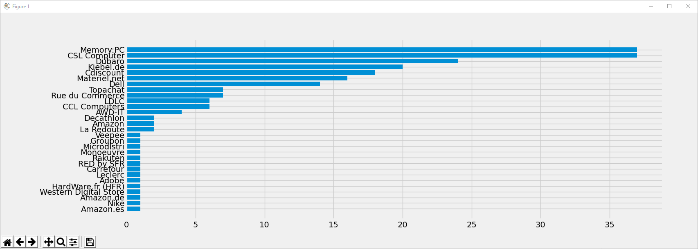

# Dealabs_Scrap
Scrapper les deals d'un utilisateur pour avoir la liste des sites par ordre d'utilisation

Aller sur la page deals d'un utilisateur et récupérer l'adresse http:
https://www.dealabs.com/profile/Bleezes77/bons-plans
Observer également le nombre de page de deal de l'utilisateur. Dans notre cas, 12.

Modifier ligne 21 la limite maximale de i pour parcourir les pages de deals. Dans notre cas, 13.

Modifier l'url ligne 22 pour mettre le nom d'utilisateur souhaité.
    url = f"https://www.dealabs.com/profile/Bleezes77/bons-plans?page={i}"

Exécuter le script.
Résultat:

